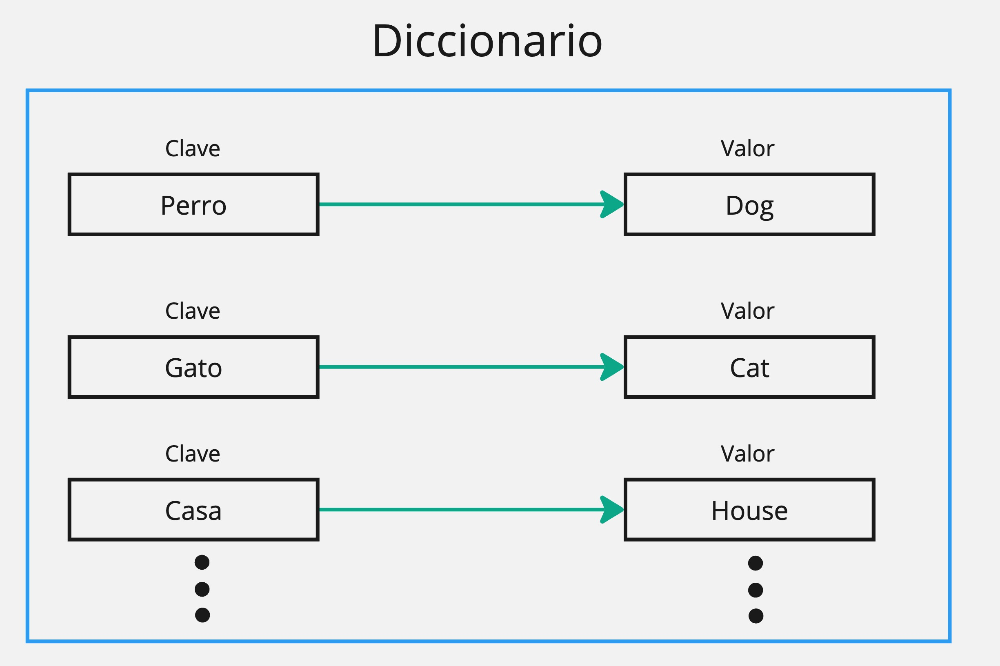
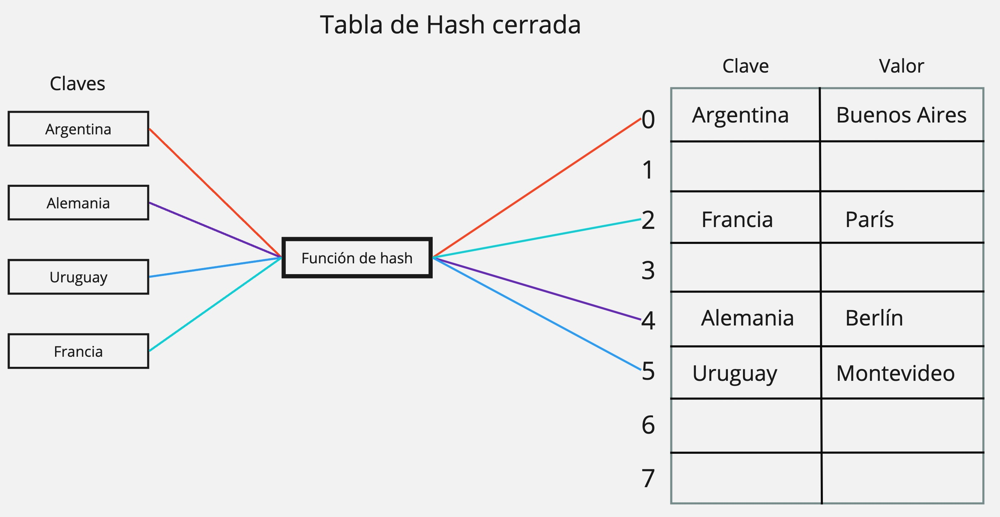
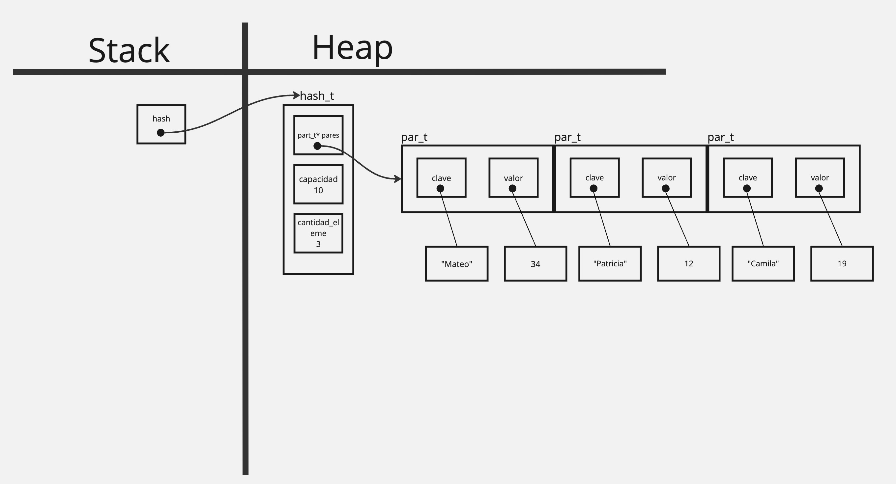

<div align="right">

</div>

# TDA HASH

## Repositorio de Lucas Martín Areco Gonzalez - 111203 - lareco@fi.uba.ar

- Para compilar:

```bash
make pruebas_alumno
```

- Para ejecutar:

```bash
./pruebas_alumno
```

- Para ejecutar con valgrind:
```bash
valgrind ./pruebas_alumno
```
---
## Diccionarios, Tablas de Hash y más...

Un diccionario es una colección de pares clave-valor, en la que cada par consta de una clave y un valor asociado. La clave actúa como un índice para acceder al valor correspondiente.


<div align="center">

</div>

## 
Podemos describir tres formas de implementar un diccionario, cada una con su propia complejidad computacional en las operaciones principales (insertar, quitar, buscar, etc.), especialmente en la búsqueda de elementos:

Una posible implementación es utilizando una **lista enlazada** donde cada elemento es un par clave-valor. En esta estructura, la búsqueda tiene complejidad **O(n)**, ya que se debe recorrer la lista secuencialmente.

Otra opción es utilizar un **árbol binario de búsqueda (ABB)**, donde cada nodo es un par clave-valor. La búsqueda en un ABB balanceado tiene una complejidad de **O(log n)**, lo que lo hace más eficiente que una lista enlazada, pero aún se puede mejorar.

Para una mayor eficiencia en las operaciones, se puede implementar una tabla de hash. 

Una **tabla de hash** es una estructura de datos que facilita la asociación de claves con valores mediante el uso de una función de hash. Esta **función de hash** convierte los valores de las claves en números hash, los cuales se utilizan para asignar las claves a ubicaciones específicas dentro de la tabla. Esto agiliza el acceso a los valores correspondientes.

Gracias a esta implementación, las operaciones de búsqueda, inserción y eliminación en una tabla de hash tienen una complejidad promedio constante, **O(1)**, lo que la convierte en una estructura de datos altamente eficiente. No obstante, la eficiencia de la tabla depende en gran medida de cómo se manejen las colisiones y de la calidad de la función de hash utilizada.

Una buena función de hash debe considerar algunos puntos: 
- **Cada clave tiene que tener un valor hash único asociado**. Esto es muy dificil de lograr en la práctica y es probable que varias claves diferentes produzcan el mismo valor hash. 
- **Calcular el hash rapidamente**. El tiempo que toma en calcular el hash debe ser en base al tamaño de la entrada y no comprometer la eficiencia del programa, donde justamente usamos una tabla de hash para mejorarla.
- **Evitar colisiones**. Esta relacionado con el primer punto, debe minimizar las colisiones. 
- **Misma entrada, mismo valor hash**. Siempre que se le ingrese una misma clave, nos tiene que devolver el mismo valor hash. Esto es importante si se quiere actualizar un valor dentro de la tabla (esto dependera de la implementación si se puede actualizar o no), ya que podemos confiar en que se va a acceder a la posición correcta.

Cabe destacar que existen dos tipos principales de tablas de hash: las tablas de hash cerradas con direccionamiento abierto y las tablas de hash abiertas con direccionamiento cerrado. La diferencia esta en donde se almacenan los valores y cómo se resuelven las colisiones, es decir, que decisión toma cuando dos claves distintas generan el mismo valor de hash.

En las **tablas de hash cerradas con direccionamiento abierto**, la estructura almacena los pares clave-valor directamente en la tabla misma, lo que le da el nombre de "cerrada". Cuando se produce una colisión, esta implementación maneja la colisión buscando una ubicación alternativa dentro de la misma tabla para almacenar el par adicional. Esto puede implicar una variedad de métodos, como probing lineal, probing cuadrático o hash doble, entre otros.

<div align="center">

</div>

####
- **Probing Lineal**: Busca secuencialmente la siguiente posición disponible en la tabla de hash cuando se produce una colisión.
####
- **Probing Cuadrático**: Usa la cantidad de intentos fallidos para intentar insertar.
####
- **Hash Doble**: Emplea una segunda función de hash para calcular la siguiente posición disponible cuando se produce una colisión. 


Por otro lado, las **tablas de hash abiertas con direccionamiento cerrado** resuelven las colisiones a través del encadenamiento, almacenando los pares clave-valor en estructuras de datos adicionales, como listas enlazadas o árboles, que están fuera de la tabla principal. Este enfoque permite que la tabla tenga múltiples pares almacenados en la misma posición, distribuidos en la estructura elegida.


##  Implementación

La implementación del hash cerrado con direccionamiento abierto se llevó a cabo partiendo de la creación de una estructura `struct hash` que tiene como campos su capacidad, un puntero a un vector de `par_t` y la cantidad total de pares.
```c
struct hash {
	size_t capacidad;
	par_t* pares;
	size_t cantidad_pares;
};
```
Al mismo tiempo, para cada clave-valor se armó la estructura `par_t`.
```c
typedef struct par {
	char* clave;
	void* valor;
} par_t;
```
En el diagrama, se presenta un ejemplo del hash a nivel memoria.
<div align="center">

</div>

####
Una vez creado el hash, se implemento `hash_insertar` donde se insertan los pares pero además se controla bajo que condiciones se hace el rehasing, es decir, en que momento hay que redimensionar la tabla, en esta implementación se duplica la capacidad cuando el factor de carga. Para hacer el rehashing hay una función llamada `rehash`, donde se crea otro hash auxiliar, se recalculan las posiciones con la función de hash y luego se le devuelve el vector de pares nuevo al hash original. En relación a la función de hash, se utiliza la función djb2. También, se hace uso de la funcion `obtener_par` que es muy útil para tomar un par clave-valor buscado y operar con él. Por otro lado, cuando se inserta se llama a `copiar_clave`, que copia la clave que pasa el usuario para que esta no sea modificada.

Si añadimos elementos, tambien se tienen que poder quitar, por eso `hash_quitar` quita la clave y valor del par a eliminar y reorganiza la posición de los pares usando un método lineal para mantener la integridad del TDA. Para esto, se implementó `reemplazar_al_quitar` que se fija si en el lugar donde se quito un par, se puede reemplazar por otro que ya estaba en el hash y que le corresponda esa misma posición por su valor de hash. 

Para obtener valores del hash utilizando su clave, se implementó `hash_obtener` que devuelve el valor pasandole la clave. Al mismo tiempo, para saber simplemente si el valor esta en el hash se utiliza `hash_contiene`. Luego se puede conocer la cantidad de pares que tiene el hash ya que en su estructura se agregó ese campo y se puede ir haciendo un seguimiento a medida que se inserta o elimian los pares. 

Por último, se implementó un iterador interno que le aplica a cada clave-valor una función que le pase el usuario. También se construyeron las funciones para destruir el hash, y si se usa un destructor, todos los elementos que haya conectado el usuario al hash. 

